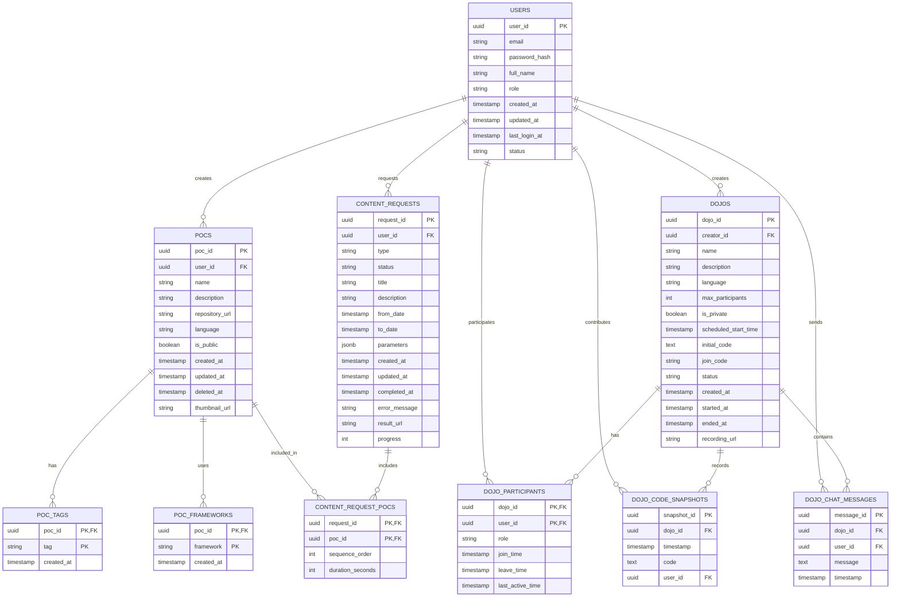
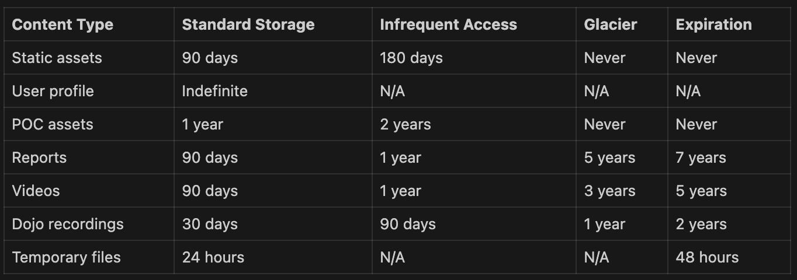

# 🧬 Template

This is a template created by Diego Pacheco which the goal to better describe a tought process which is called architecture. This should be used to learn software architecture and to pratice with use cases.

## 🏛️ Structure

### 1. 🎯 Problem Statement and Context

````
Mr Bill wants a system to keep track of his favorite POCs. You need to build a mobile app where Mr Bill can register all his pocs, and he also needs to be able to search POCs by: name, language, by tags. This system should be multi-tenant, because Mr Bill will sell the system to a bunch of people in Brazil. Such system must also have the ability to generate reports and generate a video with all the pocs the user did in 1 year.

Such system must be secure and have proper login and be able to support realtime dojos using the Mr Bill platform you will build for him.
````


### 2. 🎯 Goals

1. Reliable solution with a balance between high availability and cost efficiency.
2. Robust security
3. Follow good practices of code
4. Modern technology stack
5. Designed for anti-fragility

### 3. 🎯 Non-Goals

1. Usage of Lambdas
2. A monolith or distributed monoliths
3. Single AZ solutions
4. No Ionic
5. We need a single language for mobile, needs to be native
6. No MongoDB
7. Having a single Relational DB for everything
8. Clouds other than AWS

### 📐 3. Principles

1. Low coupling - stray very far away from monoliths or distributed monoliths.
2. Reliability - design a highly available and reliable system
3. Security - follow good security practices with multi-layer security

### 🏗️ 4. Overall Diagrams


Here there will be a bunch of diagrams, to understand the solution.
```
🗂️ 4.1 Overall architecture: Show the big picture, relationship between macro components.
🗂️ 4.2 Deployment: Show the infra in a big picture. 
🗂️ 4.3 Use Cases: Make 1 macro use case diagram that list the main capability that needs to be covered. 
```
Recommended Reading: http://diego-pacheco.blogspot.com/2020/10/uml-hidden-gems.html

### 🧭 5. Trade-offs

List the tradeoffs analysis, comparing pros and cons for each major decision.
Before you need list all your major decisions, them run tradeoffs on than.
example:
Major Decisions: 
```
1. One mobile code base - should be (...)
2. Reusable capability and low latency backends should be (...)
3. Cache efficiency therefore should do (...)
```
Tradeoffs:
```
1. React Native vs (Flutter and Native)
2. Services vs Serverless
3. Redis vs Enbeded Caches
```
Each tradeoff line need to be:
```
PROS (+) 
  * Benefit: Explanation that justify why the benefit is true.
CONS (+)
  * Problem: Explanation that justify why the problem is true.
```

Major Decisions:

1. No monoliths
2. Single native language for mobile
3. Multiple DBs - not one relational DB for everything
4. Restricted to AWS

Tradeoffs:
## 1. SOA (Service Oriented Architecture) vs Monoliths

PROS: 
  -  Better isolation
  - Horizontal Scalability
  - No Single Point of Failure

CONS:
  - Higher time to market (more development time)
  - Might be unnecessary spending if the platform is not used enough


## 2. Services vs Serverless

PROS:
  - Predictable performance
  - No need to worry about cold starts

CONS:
  - More infrastructure management
  - Might be more expensive than serverless depending on the workflows

## 3. Multiple DBs vs One Relational DB

PROS:
- Specialized DBs will incur better performance
- No distributed monolith
- Loosen coupling

CONS:
- Higher cost to maintain
- Higher integration between data sources and services needed

## 4. Restrict to AWS vs Private Cloud

PROS:
- Need to worry less about maintenance
- Usage of managed services will ease development and operations

CONS:
- If many managed solutions are used you might end up with vendor lock-in
- If using pay-as-you-go cost might be a big issue

### 🌏 6. For each key major component

What is a majore component? A service, a lambda, a important ui, a generalized approach for all uis, a generazid approach for computing a workload, etc...
```
6.1 - Class Diagram              : classic uml diagram with attributes and methods
6.2 - Contract Documentation     : Operations, Inputs and Outputs
6.3 - Persistence Model          : Diagrams, Table structure, partiotioning, main queries.
6.4 - Algorithms/Data Structures : Spesific algos that need to be used, along size with spesific data structures.
```

Exemplos of other components: Batch jobs, Events, 3rd Party Integrations, Streaming, ML Models, ChatBots, etc... 

Recommended Reading: http://diego-pacheco.blogspot.com/2018/05/internal-system-design-forgotten.html

#### 6.2 - Contract Documentation

##### Authentication Service Contracts

###### Create User

- **Endpoint**: `POST /api/v1/users`
- **Description**: Creates a new user in the system
- **Authentication**: None (public endpoint)
- **Request Body**:
  ```json
  {
    "email": "string",
    "password": "string",
    "fullName": "string",
    "companyName": "string",
    "role": "string"
  }
  ```
- **Response Body**:
  ```json
  {
    "userId": "uuid",
    "email": "string",
    "fullName": "string",
    "companyName": "string",
    "role": "string",
    "createdAt": "ISO-8601 timestamp"
  }
  ```
- **Status Codes**:
  - `201 Created`: User created successfully
  - `400 Bad Request`: Invalid input parameters
  - `409 Conflict`: Email already exists
  - `500 Internal Server Error`: Server error

###### User Login

- **Endpoint**: `POST /api/v1/auth/login`
- **Description**: Authenticates a user and returns access tokens
- **Authentication**: None (public endpoint)
- **Request Body**:
  ```json
  {
    "email": "string",
    "password": "string",
    "tenantId": "uuid"
  }
  ```
- **Response Body**:
  ```json
  {
    "accessToken": "string",
    "refreshToken": "string",
    "expiresIn": "number (seconds)",
    "tokenType": "Bearer",
    "userId": "uuid"
  }
  ```
- **Status Codes**:
  - `200 OK`: Authentication successful
  - `400 Bad Request`: Invalid credentials
  - `401 Unauthorized`: Invalid credentials
  - `403 Forbidden`: Account locked or requires verification
  - `500 Internal Server Error`: Server error

##### POC Management Service Contracts

###### Create POC

- **Endpoint**: `POST /api/v1/pocs`
- **Description**: Creates a new POC with metadata
- **Authentication**: Required (Bearer token)
- **Request Body**:
  ```json
  {
    "name": "string",
    "description": "string",
    "repositoryUrl": "string",
    "language": "string",
    "tags": ["string", "string", ...],
    "frameworks": ["string", "string", ...],
    "isPublic": "boolean"
  }
  ```
- **Response Body**:
  ```json
  {
    "pocId": "uuid",
    "name": "string",
    "description": "string",
    "repositoryUrl": "string",
    "language": "string",
    "tags": ["string", "string", ...],
    "frameworks": ["string", "string", ...],
    "isPublic": "boolean",
    "userId": "uuid",
    "tenantId": "uuid",
    "createdAt": "ISO-8601 timestamp",
    "updatedAt": "ISO-8601 timestamp"
  }
  ```
- **Status Codes**:
  - `201 Created`: POC created successfully
  - `400 Bad Request`: Invalid input parameters
  - `401 Unauthorized`: Missing or invalid authentication
  - `500 Internal Server Error`: Server error

###### List User POCs

- **Endpoint**: `GET /api/v1/pocs`
- **Description**: Lists all POCs for the authenticated user
- **Authentication**: Required (Bearer token)
- **Query Parameters**:
  - `page`: Page number (default: 1)
  - `pageSize`: Items per page (default: 20, max: 100)
  - `sortBy`: Field to sort by (default: 'createdAt')
  - `sortOrder`: Sort direction ('asc' or 'desc', default: 'desc')
  - `language`: Filter by programming language
  - `tags`: Filter by tags (comma-separated)
  - `search`: Search term to match against name or description
- **Response Body**:
  ```json
  {
    "items": [
      {
        "pocId": "uuid",
        "name": "string",
        "description": "string",
        "repositoryUrl": "string",
        "language": "string",
        "tags": ["string", "string", ...],
        "frameworks": ["string", "string", ...],
        "isPublic": "boolean",
        "createdAt": "ISO-8601 timestamp",
        "updatedAt": "ISO-8601 timestamp"
      }
    ],
    "pagination": {
      "page": "number",
      "pageSize": "number",
      "totalItems": "number",
      "totalPages": "number"
    }
  }
  ```
- **Status Codes**:
  - `200 OK`: Successful retrieval
  - `400 Bad Request`: Invalid query parameters
  - `401 Unauthorized`: Missing or invalid authentication
  - `500 Internal Server Error`: Server error

##### Content Generation Service Contracts

###### Generate POC Video

- **Endpoint**: `POST /api/v1/content/videos`
- **Description**: Generates a video showcasing the user's POCs from the past year
- **Authentication**: Required (Bearer token)
- **Request Body**:
  ```json
  {
    "title": "string",
    "description": "string",
    "fromDate": "ISO-8601 timestamp", // Optional, defaults to 1 year ago
    "toDate": "ISO-8601 timestamp", // Optional, defaults to current date
    "includeTags": ["string", "string", ...], // Optional filter
    "excludeTags": ["string", "string", ...], // Optional filter
    "style": "string", // Video template style
    "musicTrack": "string" // Optional background music
  }
  ```
- **Response Body**:
  ```json
  {
    "requestId": "uuid",
    "status": "PENDING",
    "estimatedCompletionTime": "ISO-8601 timestamp"
  }
  ```
- **Status Codes**:
  - `202 Accepted`: Request accepted for processing
  - `400 Bad Request`: Invalid input parameters
  - `401 Unauthorized`: Missing or invalid authentication
  - `403 Forbidden`: Insufficient permissions
  - `500 Internal Server Error`: Server error

###### Get Video Generation Status

- **Endpoint**: `GET /api/v1/content/videos/{requestId}`
- **Description**: Checks the status of a video generation request
- **Authentication**: Required (Bearer token)
- **Path Parameters**:
  - `requestId`: UUID of the video generation request
- **Response Body**:
  ```json
  {
    "requestId": "uuid",
    "status": "string", // PENDING, PROCESSING, COMPLETED, FAILED
    "progress": "number", // 0-100 percentage
    "videoUrl": "string", // Available when status is COMPLETED
    "thumbnailUrl": "string", // Available when status is COMPLETED
    "errorMessage": "string", // Available when status is FAILED
    "createdAt": "ISO-8601 timestamp",
    "completedAt": "ISO-8601 timestamp" // Available when status is COMPLETED or FAILED
  }
  ```
- **Status Codes**:
  - `200 OK`: Successful retrieval
  - `401 Unauthorized`: Missing or invalid authentication
  - `403 Forbidden`: Insufficient permissions
  - `404 Not Found`: Request not found
  - `500 Internal Server Error`: Server error

###### Generate POC Report

- **Endpoint**: `POST /api/v1/content/reports`
- **Description**: Generates a report of the user's POCs from the past year
- **Authentication**: Required (Bearer token)
- **Request Body**:
  ```json
  {
    "title": "string",
    "fromDate": "ISO-8601 timestamp", // Optional, defaults to 1 year ago
    "toDate": "ISO-8601 timestamp", // Optional, defaults to current date
    "includeTags": ["string", "string", ...], // Optional filter
    "excludeTags": ["string", "string", ...], // Optional filter
    "groupBy": ["language", "tag", "month"], // How to group statistics
    "format": "string" // PDF, EXCEL, CSV
  }
  ```
- **Response Body**:
  ```json
  {
    "reportId": "uuid",
    "status": "PENDING",
    "estimatedCompletionTime": "ISO-8601 timestamp"
  }
  ```
- **Status Codes**:
  - `202 Accepted`: Request accepted for processing
  - `400 Bad Request`: Invalid input parameters
  - `401 Unauthorized`: Missing or invalid authentication
  - `403 Forbidden`: Insufficient permissions
  - `500 Internal Server Error`: Server error

###### Get Report Status

- **Endpoint**: `GET /api/v1/content/reports/{reportId}`
- **Description**: Checks the status of a report generation request
- **Authentication**: Required (Bearer token)
- **Path Parameters**:
  - `reportId`: UUID of the report generation request
- **Response Body**:
  ```json
  {
    "reportId": "uuid",
    "status": "string", // PENDING, PROCESSING, COMPLETED, FAILED
    "progress": "number", // 0-100 percentage
    "reportUrl": "string", // Available when status is COMPLETED
    "format": "string" // PDF, EXCEL, CSV
    "errorMessage": "string", // Available when status is FAILED
    "createdAt": "ISO-8601 timestamp",
    "completedAt": "ISO-8601 timestamp" // Available when status is COMPLETED or FAILED
  }
  ```
- **Status Codes**:
  - `200 OK`: Successful retrieval
  - `401 Unauthorized`: Missing or invalid authentication
  - `403 Forbidden`: Insufficient permissions
  - `404 Not Found`: Report not found
  - `500 Internal Server Error`: Server error

##### Dojo Service Contracts

###### Create Dojo

- **Endpoint**: `POST /api/v1/dojos`
- **Description**: Creates a new collaborative coding dojo
- **Authentication**: Required (Bearer token)
- **Request Body**:
  ```json
  {
    "name": "string",
    "description": "string",
    "language": "string",
    "maxParticipants": "number", // Optional, defaults to unlimited
    "scheduledStartTime": "ISO-8601 timestamp", // Optional, now if not provided
    "isPrivate": "boolean", // If true, requires invitations
    "initialCode": "string" // Optional starter code
  }
  ```
- **Response Body**:
  ```json
  {
    "dojoId": "uuid",
    "name": "string",
    "description": "string",
    "language": "string",
    "maxParticipants": "number",
    "scheduledStartTime": "ISO-8601 timestamp",
    "isPrivate": "boolean",
    "initialCode": "string",
    "creatorId": "uuid",
    "tenantId": "uuid",
    "joinCode": "string", // For sharing with participants
    "status": "string", // SCHEDULED, ACTIVE, COMPLETED, CANCELLED
    "createdAt": "ISO-8601 timestamp"
  }
  ```
- **Status Codes**:
  - `201 Created`: Dojo created successfully
  - `400 Bad Request`: Invalid input parameters
  - `401 Unauthorized`: Missing or invalid authentication
  - `403 Forbidden`: Insufficient permissions
  - `500 Internal Server Error`: Server error

###### WebSocket Connection for Dojo

- **Endpoint**: `WSS /api/v1/dojos/{dojoId}/live`
- **Description**: Establishes WebSocket connection for real-time dojo participation
- **Authentication**: Required (Bearer token as query parameter or Authentication header)
- **Path Parameters**:
  - `dojoId`: UUID of the dojo session
- **Query Parameters**:
  - `token`: Authentication token (alternative to Authorization header)
  - `role`: Role in the session ("PARTICIPANT" or "OBSERVER")
- **WebSocket Messages (Client to Server)**:
  - Code update:
    ```json
    {
      "type": "CODE_UPDATE",
      "content": "string", // The updated code
      "position": {
        "line": "number", 
        "column": "number"
      },
      "selection": {
        "start": { "line": "number", "column": "number" },
        "end": { "line": "number", "column": "number" }
      }
    }
    ```
  - Chat message:
    ```json
    {
      "type": "CHAT_MESSAGE",
      "content": "string"
    }
    ```
  - Run code:
    ```json
    {
      "type": "RUN_CODE",
      "language": "string" // Optional, defaults to dojo language
    }
    ```
  - Cursor position:
    ```json
    {
      "type": "CURSOR_POSITION",
      "position": {
        "line": "number",
        "column": "number"
      }
    }
    ```
- **WebSocket Messages (Server to Client)**:
  - Code update broadcast:
    ```json
    {
      "type": "CODE_UPDATE",
      "userId": "uuid",
      "userName": "string",
      "content": "string",
      "position": {
        "line": "number", 
        "column": "number"
      },
      "timestamp": "ISO-8601 timestamp"
    }
    ```
  - Participant list:
    ```json
    {
      "type": "PARTICIPANT_LIST",
      "participants": [
        {
          "userId": "uuid",
          "userName": "string",
          "role": "string",
          "cursorPosition": {
            "line": "number",
            "column": "number"
          },
          "connected": "boolean",
          "lastActive": "ISO-8601 timestamp"
        }
      ]
    }
    ```
  - Chat message broadcast:
    ```json
    {
      "type": "CHAT_MESSAGE",
      "userId": "uuid",
      "userName": "string",
      "content": "string",
      "timestamp": "ISO-8601 timestamp"
    }
    ```
  - Code execution result:
    ```json
    {
      "type": "CODE_EXECUTION_RESULT",
      "requestId": "uuid",
      "status": "string", // SUCCESS, ERROR, TIMEOUT
      "output": "string",
      "executionTime": "number", // milliseconds
      "memory": "number", // bytes used
      "error": "string" // if status is ERROR
    }
    ```
  - Connection status:
    ```json
    {
      "type": "CONNECTION_STATUS",
      "status": "string", // CONNECTED, RECONNECTING, DISCONNECTED
      "reason": "string" // If status is DISCONNECTED
    }
    ```
- **Error Codes**:
  - `4001`: Authentication failed
  - `4002`: Dojo not found
  - `4003`: Dojo is full
  - `4004`: User not authorized to join this dojo

###### Execute Dojo Code

- **Endpoint**: `POST /api/v1/dojos/{dojoId}/execute`
- **Description**: Executes code in the GraalVM Polyglot environment
- **Authentication**: Required (Bearer token)
- **Path Parameters**:
  - `dojoId`: UUID of the dojo session
- **Request Body**:
  ```json
  {
    "code": "string",
    "language": "string", // Optional, defaults to dojo language
    "timeout": "number", // Max execution time in ms (optional)
    "arguments": ["string", "string", ...], // Optional command-line arguments
    "stdin": "string" // Optional standard input
  }
  ```
- **Response Body**:
  ```json
  {
    "executionId": "uuid",
    "status": "string", // SUCCESS, ERROR, TIMEOUT
    "output": "string", // stdout + stderr
    "stdout": "string",
    "stderr": "string",
    "executionTime": "number", // milliseconds
    "memoryUsed": "number", // bytes
    "cpuTime": "number", // milliseconds
    "language": "string",
    "error": {
      "message": "string",
      "line": "number",
      "column": "number",
      "stackTrace": "string"
    } // Present if status is ERROR
  }
  ```
- **Status Codes**:
  - `200 OK`: Code executed successfully (even if the code itself has errors)
  - `400 Bad Request`: Invalid input parameters
  - `401 Unauthorized`: Missing or invalid authentication
  - `403 Forbidden`: Insufficient permissions
  - `404 Not Found`: Dojo not found
  - `422 Unprocessable Entity`: Code execution failed due to server constraints
  - `500 Internal Server Error`: Server error

### 🖹 7. Migrations

No migrations necessary.

### 🖹 8. Testing strategy

Our multi-layered testing strategy ensures quality, reliability, and security across the Mr. Bill platform:

#### Unit Tests
- **Coverage**: Aim for >85% code coverage in all services
- **Framework**: Jest for JavaScript/TypeScript, JUnit for Java
- **Mocking**: Use mock libraries to isolate units (Mockito for Java, Jest mocks for JS/TS)
- **Run frequency**: On every commit via CI pipeline

#### Integration Tests
- **Scope**: Verify interactions between services, databases, and third-party APIs
- **Approach**: Use test containers for database integration
- **Tools**: Postman collections for API testing, Testcontainers for DB testing
- **Run frequency**: Daily in CI pipeline

#### Contract Tests
- **Purpose**: Ensure service interfaces don't break consumer expectations
- **Tools**: Pact for consumer-driven contract testing
- **Implementation**: Define consumer expectations as contracts
- **Run frequency**: On API changes and during integration tests

#### End-to-End Tests
- **Scope**: Test complete user flows across the entire system
- **Tools**: Cypress for web, Detox for mobile
- **Scenarios**: Cover critical user journeys (POC creation, search, reporting)
- **Run frequency**: Nightly and before releases

#### UI Tests
- **Scope**: Verify UI components and interactions
- **Tools**: React Testing Library for components, Storybook for visual testing
- **Visual regression**: Percy for visual comparisons
- **Accessibility**: Include a11y tests using axe-core

#### Smoke Tests
- **Purpose**: Verify core functionality after deployment
- **Scope**: Login, POC creation, search, basic reporting
- **Run frequency**: After every deployment to any environment
- **Implementation**: Automated via CI/CD pipeline

#### Stress Tests
- **Purpose**: Verify system behavior under heavy load
- **Tools**: JMeter, Gatling, Locust
- **Scenarios**: High-volume POC creation, concurrent searches, report generation
- **Metrics**: Response time, error rate, resource utilization
- **Run frequency**: Monthly and before major releases

#### Chaos Tests
- **Purpose**: Ensure system resilience during failures
- **Tools**: Chaos Monkey, AWS Fault Injection Simulator
- **Scenarios**: Database failures, service outages, network latency
- **Implementation**: Controlled experiments in staging environment
- **Run frequency**: Quarterly

#### Mutation Tests
- **Purpose**: Verify test quality by modifying code
- **Tools**: Stryker for JavaScript, PIT for Java
- **Coverage**: Focus on critical services and business logic
- **Run frequency**: Weekly in development environment

#### Fuzzing Tests
- **Purpose**: Find security vulnerabilities and edge cases
- **Tools**: AFL for API fuzzing, OWASP ZAP for security
- **Targets**: API endpoints, input validation, authentication
- **Run frequency**: Monthly and for security-sensitive changes

#### Exploratory Tests
- **Approach**: Structured exploratory testing sessions
- **Documentation**: Use session-based testing with recorded findings
- **Focus areas**: New features, complex workflows, reported issues
- **Run frequency**: Before major releases and for complex features

#### A/B Tests
- **Purpose**: Compare feature variants with real users
- **Implementation**: Feature flags via LaunchDarkly
- **Metrics**: User engagement, time spent, feature adoption
- **Analysis**: Statistical significance testing for decision making
- **Monitoring**: Real-time dashboards for experiment monitoring

#### Testing Environments
1. **Development**: Unit, integration tests
2. **QA**: All automated tests except stress and chaos
3. **Staging**: Full suite including stress and chaos tests
4. **Production**: Smoke tests, A/B tests, production monitoring

#### Test Data Management
- Anonymized production data for realistic testing
- Seed data scripts for consistent test environments
- Data cleanup processes after test execution

#### Mocking Strategy
- External APIs mocked during unit and integration testing
- Service virtualization for third-party dependencies
- Consistent mocking patterns across test suites

### 🖹 9. Observability strategy

#### Distributed Tracing

- **Technology**: AWS X-Ray integrated with OpenTelemetry
- **Implementation**:
  - Unique trace ID propagated across all microservices
  - Automatic instrumentation for Java services via X-Ray SDK
  - Manual instrumentation for critical business operations
  - Sampling strategy: 100% for errors, 5% for successful requests
- **Key Metrics**:
  - End-to-end transaction latency
  - Service-to-service communication time
  - Dependency bottlenecks identification
  - Error tracing across service boundaries
- **Correlation**: Trace IDs embedded in logs and metrics for cross-referencing

#### Log Management

- **Collection**: AWS CloudWatch Logs with Fluent Bit agents
- **Processing**: CloudWatch Logs Insights for real-time analysis
- **Long-term Storage**: S3 with lifecycle policies (30 days hot, 1 year cold)
- **Standardization**:
  - JSON structured logging format
  - Common fields: timestamp, service, traceId, spanId, severity
  - Context-specific fields for business events
- **Log Levels**:
  - ERROR: All exceptions and failures
  - WARN: Degraded service, retries, slow operations
  - INFO: Key business events, service startup/shutdown
  - DEBUG: Development-only, disabled in production
- **Sensitive Data**: PII automatically redacted before ingestion

#### APM (Application Performance Monitoring)

- **Technology**: AWS CloudWatch ServiceLens with X-Ray integration
- **Instrumentation**: 
  - Automatic JVM metrics for Java services
  - Custom instrumentation for business-critical paths
  - Database query performance tracking
- **Key Metrics**:
  - Application response time distributions
  - Error rates and exception counts
  - Memory usage patterns
  - Garbage collection metrics
  - Thread pool utilization
  - Database connection pool metrics
- **Business Metrics**:
  - POC creation rate
  - Search latency
  - Video generation time
  - Tenant-specific usage patterns

#### Infrastructure Metrics

- **Collection**: AWS Managed Prometheus
- **Visualization**: AWS Managed Grafana
- **Key Metrics**:
  - CPU, memory, disk utilization
  - Network throughput and errors
  - Container health and restart counts
  - Database connection counts and query performance
  - Cache hit/miss ratios
  - Message queue depths and processing rates
- **Custom Metrics**:
  - Business-specific throughput indicators
  - Multi-tenancy resource utilization
  - Search engine performance metrics
  - Video processing queue metrics

#### Mobile Performance Monitoring

- **Technology**: AWS Pinpoint Analytics + Firebase Performance Monitoring
- **Key Metrics**:
  - App startup time
  - Screen render time
  - API call latency from device
  - UI responsiveness (frame rate)
  - App stability (crash rate)
  - Network errors from mobile perspective
  - Battery consumption
  - Memory usage on device
- **User Experience Metrics**:
  - Time to interactive
  - Tap response time
  - Search completion time
  - Video playback metrics
- **Segmentation**:
  - By device type
  - OS version
  - Network type (WiFi/4G/5G)
  - Geographic location

#### Alerting Strategy

- **Primary Tool**: AWS CloudWatch Alarms with PagerDuty integration
- **Severity Levels**:
  - P1: Service outage, immediate response (24/7)
  - P2: Service degradation, response within 1 hour
  - P3: Non-critical issues, next business day
- **Alert Types**:
  - Static threshold alerts
  - Anomaly detection alerts
  - Composite alerts (multiple conditions)
  - Forecast-based alerts (predictive)
- **Key Alerts**:
  - Error rate > 1% (P1)
  - API latency > 500ms (P2)
  - Database CPU > 80% (P2)
  - Disk usage > 85% (P3)
  - Failed tenant authentications spike (P1)
  - Video generation failure > 5% (P2)
- **Alert Reduction**:
  - Correlation rules to prevent alert storms
  - Auto-remediation for known issues
  - Alert suppression during maintenance windows

#### Dashboard Strategy

- **Organization**:
  - Executive dashboard (high-level SLAs, business metrics)
  - Service-specific dashboards (per-service health)
  - Infrastructure dashboards
  - Mobile app performance dashboards
  - Tenant-specific dashboards
- **Key Visualizations**:
  - Service health heatmap
  - Request volume and latency histograms
  - Error rate time-series
  - Resource utilization gauges
  - User experience metrics
  - Business KPI correlations with system performance

#### SLOs and SLIs

- **Service Level Objectives**:
  - API availability: 99.9%
  - API latency (95th percentile): < 300ms
  - Search results: < 1s
  - Video generation: < 10 minutes
  - Mobile app crash rate: < 0.1%
- **SLI Measurement**:
  - Synthetic monitoring probes
  - Real user monitoring data
  - Error budget tracking
  - Burn rate alerts for SLO violations

#### Correlation and Root Cause Analysis

- **Implementation**:
  - Common correlation IDs across all observability data
  - Service dependency mapping
  - Automated RCA suggestions
  - Change event correlation with incidents
- **Tools**:
  - AWS X-Ray service maps
  - Custom Grafana dashboards with unified metrics/logs/traces

### 🖹 10. Data Store Designs

Persistence Model - Table Structure and Main Queries



##### PostgreSQL Database Schemas

##### Users
```sql
CREATE TABLE users (
  user_id UUID PRIMARY KEY DEFAULT gen_random_uuid(),
  email VARCHAR(255) NOT NULL UNIQUE,
  password_hash VARCHAR(255) NOT NULL,
  full_name VARCHAR(100) NOT NULL,
  role VARCHAR(20) NOT NULL DEFAULT 'USER',
  created_at TIMESTAMP WITH TIME ZONE NOT NULL DEFAULT NOW(),
  updated_at TIMESTAMP WITH TIME ZONE NOT NULL DEFAULT NOW(),
  last_login_at TIMESTAMP WITH TIME ZONE,
  status VARCHAR(20) NOT NULL DEFAULT 'ACTIVE'
);

CREATE INDEX idx_users_email ON users(email);
CREATE INDEX idx_users_status ON users(status);
```

#### POCs
```sql
CREATE TABLE pocs (
  poc_id UUID PRIMARY KEY DEFAULT gen_random_uuid(),
  user_id UUID NOT NULL REFERENCES users(user_id),
  name VARCHAR(100) NOT NULL,
  description TEXT,
  repository_url VARCHAR(255) NOT NULL,
  language VARCHAR(50),
  is_public BOOLEAN NOT NULL DEFAULT FALSE,
  created_at TIMESTAMP WITH TIME ZONE NOT NULL DEFAULT NOW(),
  updated_at TIMESTAMP WITH TIME ZONE NOT NULL DEFAULT NOW(),
  deleted_at TIMESTAMP WITH TIME ZONE,
  thumbnail_url VARCHAR(255)
);

CREATE INDEX idx_pocs_user_id ON pocs(user_id);
CREATE INDEX idx_pocs_language ON pocs(language);
CREATE INDEX idx_pocs_created_at ON pocs(created_at);
CREATE INDEX idx_pocs_is_public ON pocs(is_public);

CREATE TABLE poc_tags (
  poc_id UUID NOT NULL REFERENCES pocs(poc_id) ON DELETE CASCADE,
  tag VARCHAR(50) NOT NULL,
  created_at TIMESTAMP WITH TIME ZONE NOT NULL DEFAULT NOW(),
  PRIMARY KEY (poc_id, tag)
);

CREATE INDEX idx_poc_tags_tag ON poc_tags(tag);

CREATE TABLE poc_frameworks (
  poc_id UUID NOT NULL REFERENCES pocs(poc_id) ON DELETE CASCADE,
  framework VARCHAR(50) NOT NULL,
  created_at TIMESTAMP WITH TIME ZONE NOT NULL DEFAULT NOW(),
  PRIMARY KEY (poc_id, framework)
);

CREATE INDEX idx_poc_frameworks_framework ON poc_frameworks(framework);
```

#### Content Generation(Report/Video)
```sql
CREATE TABLE content_requests (
  request_id UUID PRIMARY KEY DEFAULT gen_random_uuid(),
  user_id UUID NOT NULL REFERENCES users(user_id),
  type VARCHAR(20) NOT NULL, -- 'VIDEO' or 'REPORT'
  status VARCHAR(20) NOT NULL DEFAULT 'PENDING', -- 'PENDING', 'PROCESSING', 'COMPLETED', 'FAILED'
  title VARCHAR(100) NOT NULL,
  description TEXT,
  from_date TIMESTAMP WITH TIME ZONE,
  to_date TIMESTAMP WITH TIME ZONE,
  parameters JSONB, -- Stores format-specific parameters
  created_at TIMESTAMP WITH TIME ZONE NOT NULL DEFAULT NOW(),
  updated_at TIMESTAMP WITH TIME ZONE NOT NULL DEFAULT NOW(),
  completed_at TIMESTAMP WITH TIME ZONE,
  error_message TEXT,
  result_url VARCHAR(512),
  progress INT DEFAULT 0 -- 0-100 percentage
);

CREATE INDEX idx_content_requests_user_id ON content_requests(user_id);
CREATE INDEX idx_content_requests_status ON content_requests(status);
CREATE INDEX idx_content_requests_created_at ON content_requests(created_at);
CREATE INDEX idx_content_requests_type ON content_requests(type);

CREATE TABLE content_request_pocs (
  request_id UUID NOT NULL REFERENCES content_requests(request_id) ON DELETE CASCADE,
  poc_id UUID NOT NULL REFERENCES pocs(poc_id),
  sequence_order INT NOT NULL,
  duration_seconds INT, -- For videos
  PRIMARY KEY (request_id, poc_id)
);

CREATE INDEX idx_content_request_pocs_poc_id ON content_request_pocs(poc_id);
```

#### Dojos

```sql
CREATE TABLE dojos (
  dojo_id UUID PRIMARY KEY DEFAULT gen_random_uuid(),
  creator_id UUID NOT NULL REFERENCES users(user_id),
  name VARCHAR(100) NOT NULL,
  description TEXT,
  language VARCHAR(50) NOT NULL,
  max_participants INT,
  is_private BOOLEAN NOT NULL DEFAULT TRUE,
  scheduled_start_time TIMESTAMP WITH TIME ZONE,
  initial_code TEXT,
  join_code VARCHAR(20) NOT NULL UNIQUE,
  status VARCHAR(20) NOT NULL DEFAULT 'SCHEDULED', -- 'SCHEDULED', 'ACTIVE', 'COMPLETED', 'CANCELLED'
  created_at TIMESTAMP WITH TIME ZONE NOT NULL DEFAULT NOW(),
  started_at TIMESTAMP WITH TIME ZONE,
  ended_at TIMESTAMP WITH TIME ZONE,
  recording_url VARCHAR(512)
);

CREATE INDEX idx_dojos_creator_id ON dojos(creator_id);
CREATE INDEX idx_dojos_status ON dojos(status);
CREATE INDEX idx_dojos_join_code ON dojos(join_code);
CREATE INDEX idx_dojos_scheduled_start_time ON dojos(scheduled_start_time);

CREATE TABLE dojo_participants (
  dojo_id UUID NOT NULL REFERENCES dojos(dojo_id) ON DELETE CASCADE,
  user_id UUID NOT NULL REFERENCES users(user_id),
  role VARCHAR(20) NOT NULL DEFAULT 'PARTICIPANT', -- 'PARTICIPANT', 'OBSERVER'
  join_time TIMESTAMP WITH TIME ZONE,
  leave_time TIMESTAMP WITH TIME ZONE,
  last_active_time TIMESTAMP WITH TIME ZONE,
  PRIMARY KEY (dojo_id, user_id)
);

CREATE INDEX idx_dojo_participants_user_id ON dojo_participants(user_id);

CREATE TABLE dojo_code_snapshots (
  snapshot_id UUID PRIMARY KEY DEFAULT gen_random_uuid(),
  dojo_id UUID NOT NULL REFERENCES dojos(dojo_id) ON DELETE CASCADE,
  timestamp TIMESTAMP WITH TIME ZONE NOT NULL DEFAULT NOW(),
  code TEXT NOT NULL,
  user_id UUID REFERENCES users(user_id) -- NULL for system-generated snapshots
);

CREATE INDEX idx_dojo_code_snapshots_dojo_id ON dojo_code_snapshots(dojo_id);
CREATE INDEX idx_dojo_code_snapshots_timestamp ON dojo_code_snapshots(timestamp);

CREATE TABLE dojo_chat_messages (
  message_id UUID PRIMARY KEY DEFAULT gen_random_uuid(),
  dojo_id UUID NOT NULL REFERENCES dojos(dojo_id) ON DELETE CASCADE,
  user_id UUID NOT NULL REFERENCES users(user_id),
  message TEXT NOT NULL,
  timestamp TIMESTAMP WITH TIME ZONE NOT NULL DEFAULT NOW()
);

CREATE INDEX idx_dojo_chat_messages_dojo_id ON dojo_chat_messages(dojo_id);
CREATE INDEX idx_dojo_chat_messages_timestamp ON dojo_chat_messages(timestamp);
```

### OpenSearch

#### POC Search Index
```json
{
  "settings": {
    "index": {
      "number_of_shards": 3,
      "number_of_replicas": 1
    },
    "analysis": {
      "analyzer": {
        "code_analyzer": {
          "type": "custom",
          "tokenizer": "standard",
          "filter": ["lowercase", "asciifolding", "code_filter"]
        }
      },
      "filter": {
        "code_filter": {
          "type": "stop",
          "stopwords": ["function", "class", "var", "const", "let", "return", "if", "else", "for", "while"]
        }
      }
    }
  },
  "mappings": {
    "properties": {
      "poc_id": { "type": "keyword" },
      "user_id": { "type": "keyword" },
      "name": { 
        "type": "text", 
        "analyzer": "standard",
        "fields": {
          "keyword": { "type": "keyword" }
        }
      },
      "description": { "type": "text", "analyzer": "standard" },
      "language": { "type": "keyword" },
      "tags": { "type": "keyword" },
      "frameworks": { "type": "keyword" },
      "is_public": { "type": "boolean" },
      "repository_url": { "type": "keyword" },
      "created_at": { "type": "date" },
      "updated_at": { "type": "date" },
      "code_snippets": { "type": "text", "analyzer": "code_analyzer" }
    }
  }
}
```

#### Dojo Search Index
```json
{
  "settings": {
    "index": {
      "number_of_shards": 2,
      "number_of_replicas": 1
    }
  },
  "mappings": {
    "properties": {
      "dojo_id": { "type": "keyword" },
      "creator_id": { "type": "keyword" },
      "name": { 
        "type": "text", 
        "fields": {
          "keyword": { "type": "keyword" }
        }
      },
      "description": { "type": "text" },
      "language": { "type": "keyword" },
      "status": { "type": "keyword" },
      "is_private": { "type": "boolean" },
      "scheduled_start_time": { "type": "date" },
      "created_at": { "type": "date" },
      "started_at": { "type": "date" },
      "ended_at": { "type": "date" },
      "participant_count": { "type": "integer" },
      "tags": { "type": "keyword" }
    }
  }
}
```

### Main Queries
#### Search POC by criteria
```sql
-- PostgreSQL query to search POCs with filters
SELECT p.*, array_agg(DISTINCT pt.tag) as tags, array_agg(DISTINCT pf.framework) as frameworks
FROM pocs p
LEFT JOIN poc_tags pt ON p.poc_id = pt.poc_id
LEFT JOIN poc_frameworks pf ON p.poc_id = pf.poc_id
WHERE (p.user_id = :user_id OR p.is_public = TRUE)
  AND (:language IS NULL OR p.language = :language)
  AND (
    :search_term IS NULL OR 
    p.name ILIKE '%' || :search_term || '%' OR
    p.description ILIKE '%' || :search_term || '%'
  )
  AND p.deleted_at IS NULL
GROUP BY p.poc_id
HAVING (:tag IS NULL OR :tag = ANY(array_agg(pt.tag)))
ORDER BY p.created_at DESC
LIMIT :limit OFFSET :offset;
```

### OpenSearch POC Query
```json
{
  "query": {
    "bool": {
      "must": [
        {
          "bool": {
            "should": [
              { "term": { "user_id": "{{user_id}}" } },
              { "term": { "is_public": true } }
            ],
            "minimum_should_match": 1
          }
        },
        {
          "multi_match": {
            "query": "{{search_term}}",
            "fields": ["name^3", "description^2", "code_snippets"]
          }
        }
      ],
      "filter": [
        {
          "bool": {
            "should": [
              { "term": { "language": "{{language}}" } },
              { "bool": { "must_not": { "exists": { "field": "language" } } } }
            ]
          }
        },
        {
          "bool": {
            "should": [
              { "term": { "tags": "{{tag}}" } },
              { "bool": { "must_not": { "exists": { "field": "tags" } } } }
            ]
          }
        }
      ]
    }
  },
  "sort": [
    { "created_at": { "order": "desc" } }
  ],
  "from": "{{offset}}",
  "size": "{{limit}}",
  "aggs": {
    "languages": {
      "terms": { "field": "language", "size": 20 }
    },
    "tags": {
      "terms": { "field": "tags", "size": 50 }
    },
    "frameworks": {
      "terms": { "field": "frameworks", "size": 20 }
    }
  }
}
```

#### Get POCs for annual video
```sql
-- Get all POCs for the year for video generation
SELECT p.*, array_agg(DISTINCT pt.tag) as tags, array_agg(DISTINCT pf.framework) as frameworks
FROM pocs p
LEFT JOIN poc_tags pt ON p.poc_id = pt.poc_id
LEFT JOIN poc_frameworks pf ON p.poc_id = pf.poc_id
WHERE p.user_id = :user_id
  AND p.created_at BETWEEN :from_date AND :to_date
  AND p.deleted_at IS NULL
  AND (:include_tag IS NULL OR EXISTS (
    SELECT 1 FROM poc_tags 
    WHERE poc_id = p.poc_id AND tag = ANY(:include_tags)
  ))
  AND (:exclude_tag IS NULL OR NOT EXISTS (
    SELECT 1 FROM poc_tags 
    WHERE poc_id = p.poc_id AND tag = ANY(:exclude_tags)
  ))
GROUP BY p.poc_id
ORDER BY p.created_at ASC;
```

#### Dojo Queries
#### Find active and upcoming dojos
```SQL
-- Find active and upcoming public dojos
SELECT d.*, 
       u.full_name AS creator_name,
       COUNT(dp.user_id) AS participant_count
FROM dojos d
JOIN users u ON d.creator_id = u.user_id
LEFT JOIN dojo_participants dp ON d.dojo_id = dp.dojo_id
WHERE d.status IN ('SCHEDULED', 'ACTIVE')
  AND (d.is_private = FALSE OR d.creator_id = :user_id OR EXISTS (
    SELECT 1 FROM dojo_participants 
    WHERE dojo_id = d.dojo_id AND user_id = :user_id
  ))
  AND (:language IS NULL OR d.language = :language)
  AND (
    :search_term IS NULL OR 
    d.name ILIKE '%' || :search_term || '%' OR
    d.description ILIKE '%' || :search_term || '%'
  )
GROUP BY d.dojo_id, u.full_name
ORDER BY 
  CASE 
    WHEN d.status = 'ACTIVE' THEN 0 
    ELSE 1 
  END,
  d.scheduled_start_time ASC
LIMIT :limit OFFSET :offset;
```

#### Get Dojo details
```sql
-- Get dojo details with participants
SELECT d.*,
       u.full_name AS creator_name,
       json_agg(
         json_build_object(
           'user_id', dp.user_id,
           'full_name', pu.full_name,
           'role', dp.role,
           'join_time', dp.join_time,
           'last_active_time', dp.last_active_time
         )
       ) AS participants
FROM dojos d
JOIN users u ON d.creator_id = u.user_id
LEFT JOIN dojo_participants dp ON d.dojo_id = dp.dojo_id
LEFT JOIN users pu ON dp.user_id = pu.user_id
WHERE d.dojo_id = :dojo_id
GROUP BY d.dojo_id, u.full_name;
```

#### Get Dojo chat history
```sql
-- Get chat history for a dojo session
SELECT m.message_id,
       m.user_id,
       u.full_name AS user_name,
       m.message,
       m.timestamp
FROM dojo_chat_messages m
JOIN users u ON m.user_id = u.user_id
WHERE m.dojo_id = :dojo_id
ORDER BY m.timestamp ASC;
```

### S3 Storage Schema
```
mr-bill-platform/
│
├── static/                             # Static web resources
│   ├── images/                         # UI images
│   │   ├── logos/                      # Brand logos
│   │   ├── icons/                      # UI icons
│   │   └── backgrounds/                # Background images
│   ├── css/                            # Stylesheets
│   │   └── {version}/                  # Version-specific CSS
│   └── js/                             # JavaScript files
│       └── {version}/                  # Version-specific JavaScript
│
├── users/                              # User-specific content
│   └── {user_id}/                      # Partitioned by user ID
│       ├── profile/                    # User profile assets
│       │   └── avatar.{ext}            # User avatar
│       ├── pocs/                       # POC related assets
│       │   └── {poc_id}/               # POC specific assets
│       │       ├── thumbnail.{ext}     # POC thumbnail
│       │       └── screenshots/        # POC screenshots
│       └── reports/                    # Generated reports
│           └── {report_id}.pdf         # PDF reports
│
├── videos/                             # Generated videos
│   └── {user_id}/                      # Partitioned by user ID
│       ├── {year}/                     # Organized by year
│       │   └── {request_id}.mp4        # Video files
│       └── thumbnails/                 # Video thumbnails
│           └── {request_id}.jpg        # Thumbnail for video preview
│
├── dojos/                              # Dojo session assets
│   └── {dojo_id}/                      # Partitioned by dojo ID
│       ├── recordings/                 # Session recordings
│       │   └── {dojo_id}.mp4           # Video recording
│       └── snapshots/                  # Code snapshots
│           └── {timestamp}.json        # Snapshot at specific time
│
└── temp/                               # Temporary assets
    └── {uuid}/                         # Temporary unique folders
        └── *                           # Various temporary files
```

File Naming Convention
Files follow a standardized naming convention:

- User-generated content: `{resource_type}-{timestamp}-{uuid}.{extension}`

- System-generated content: `{resource_type}-{generation_date}-{request_id}.{extension}`

- Versioned static assets: `{resource_name}-v{version_number}.{extension}`

### Object Lifecycle Policies
Different content types have specific retention policies:



### Access Patterns

The following access patterns are supported:

- Direct authenticated access: Pre-signed URLs for temporary access to private resources
- Public access: For static resources and publicly shared POCs
- CDN distribution: For frequently accessed static assets via CloudFront
- Server-side access: For backend services generating content

### URL Examples
```
# Public POC thumbnail
https://assets.mr-bill.com/users/{user_id}/pocs/{poc_id}/thumbnail.jpg

# Pre-signed URL for video access
https://assets.mr-bill.com/videos/{user_id}/{year}/{request_id}.mp4?X-Amz-Algorithm=AWS4-HMAC-SHA256&X-Amz-Credential=...

# Static resource via CDN
https://static.mr-bill.com/images/logos/mr-bill-logo.png
```

### 🖹 11. Technology Stack

#### 11.1 Frontend Technologies
### Mobile Applications

#### Framework: Flutter (latest stable):
- Single codebase for both Android and iOS platforms
- High performance with native compilation
- Rich widget library and customization options
- Supports offline-first architecture with local SQLite storage

#### State Management: BLoC pattern with Provider

#### Networking: Dio HTTP client with interceptors for auth tokens

#### Local Storage:
- Hive for lightweight key-value storage
- SQLite for structured local data

#### Testing: Flutter Test framework with Mockito

### Web Application
#### Framework: React 18 (latest LTS):
- Component-based architecture for reusable UI elements
- Virtual DOM for efficient rendering

#### State Management: Redux Toolkit with RTK Query
#### Routing: React Router v6
#### UI Component Library: Material-UI (MUI)
#### Form Handling: React Hook Form with Yup validation
#### Data Visualization: D3.js and Chart.js for analytics dashboards
#### Code Editor: Monaco Editor (VS Code's editor) for Dojo feature
#### Real-time Communication: Socket.IO client for Dojo collaboration
#### Build Tool: Vite for faster development and optimized builds

## 11.2 Backend Services
### Service Architecture
#### Language: Java 21 (LTS)
#### Framework: Spring Boot 3 (latest)
#### API Style: RESTful services with OpenAPI 3 documentation
#### WebSocket: Spring WebSocket with STOMP for Dojo feature
#### Serialization: JSON with Jackson
#### Validation: Hibernate Validator
#### Dependency Injection: Spring IoC
#### Reactive Programming: Project Reactor for non-blocking operations

### Authentication Service
#### JWT Generation/Validation: jjwt library
#### Password Hashing: Argon2 for secure password storage
#### Role-based Access Control: Spring Security

### POC Management Service
#### Repository Integration: JGit for Git operations
#### Search Engine Client: OpenSearch Java High-Level REST Client
#### File Handling: AWS SDK for S3 operations

### Content Generation Service
#### Video Generation: FFmpeg for video processing
#### PDF Generation: Apache PDFBox
#### Template Engine: Thymeleaf for report generation
#### Image Processing: ImageMagick for thumbnails

### Dojo Service
#### Collaborative Editing: Operational Transform algorithms
#### Code Execution: GraalVM Polyglot for multi-language support

## 11.3 Database and Storage
### Relational Database
#### Engine: PostgreSQL 16 (latest LTS):
- Strong ACID compliance
- Advanced indexing capabilities
- Connection pooling with HikariCP
- Database migration with Flyway
#### ORM: Hibernate with JPA for entity management

### Search Engine
#### Engine: Amazon OpenSearch Service:
- Full-text search capabilities
- Faceted search for filtering POCs
- Aggregations for analytics
- Near real-time indexing
- Object Storage

#### Service: Amazon S3:
- Storage for POC assets, videos, reports
- Lifecycle policies for cost optimization
- Server-side encryption for sensitive data
- Presigned URLs for secure access
### Caching
#### Service: Amazon ElastiCache (Redis 7.x LTS):
- Session storage
- API response caching
- Rate limiting implementation
- Distributed locking mechanisms

## 11.4 Messaging and Integration
### Event Bus
#### Service: Amazon SNS
- Pub/sub messaging between services
- Fan-out event distribution
- Delivery status tracking

### Message Processing
#### Service: Amazon SQS:
- Decoupling services
- Message buffering for traffic spikes
- Dead letter queues for error handling

## 11.5 Infrastructure and Deployment
### Compute
#### Service: Amazon EC2 with Auto Scaling Groups:
- Right-sized instances for each service
- Spot instances for cost optimization where applicable
- Automated scaling based on load metrics
### Content Delivery
#### Service: Amazon CloudFront:
- Global distribution of static assets
- Edge caching for improved performance
- AWS Shield integration for DDoS protection
- AWS WAF for application layer protection
### API Management
#### Service: Amazon API Gateway with Application Load Balancer:
- API traffic management
- Request throttling and quotas
- API documentation with Swagger UI
### Container Management
#### Service: Amazon ECS with EC2 launch type:
- Docker containers for service isolation
- Task definitions for resource allocation
## Service auto-scaling
### Infrastructure as Code:
#### Tool: Terraform (latest):
- Declarative infrastructure definition
- Environment consistency
- Modular component design
## 11.6 Security
### Encryption and Key Management
#### Service: AWS KMS:
- Encryption key management
- Data encryption at rest and in transit
- Secure key rotation
### Identity and Access Management
#### Service: AWS IAM:
- Fine-grained access control
- Service roles and policies
- Least privilege principle
### Network Security
#### Components:
- VPC with private subnets
- Security groups and NACLs
- VPC endpoints for AWS services
- AWS Shield for DDoS protection
- AWS WAF for web application firewall
### Application Security
#### Practices:
- OWASP Top 10 mitigation strategies
- Input validation and sanitization
### Content Security Policy (CSP):
- Rate limiting and bot protection
- Dependency vulnerability scanning
## 11.7 DevOps and Monitoring
### CI/CD Pipeline
#### Service: AWS CodePipeline with GitHub Actions:
- Automated testing and deployment
- Environment promotion workflows
- Infrastructure validation
- Monitoring and Observability
### Services:
- AWS CloudWatch for metrics and logs
- X-Ray for distributed tracing
- Grafana for visualization dashboards
- Prometheus for metric collection
### Logging
#### Implementation:
- Centralized logging with CloudWatch Logs
- Structured JSON logging format
- Log retention policies
- Log-based alerting
### Alerting
#### Service: Amazon SNS with PagerDuty integration
- Critical service alerts
- Escalation policies
- On-call rotation management
## 11.8 Video and Content Processing
### Video Generation Pipeline
#### Components:
- FFmpeg for video encoding and composition
- AWS Elemental MediaConvert for transcoding
- AWS Lambda for media processing coordination
## 11.9 Technology Selection Justification
### Flutter for Mobile: Chosen for its cross-platform capabilities while maintaining near-native performance. The hot reload feature accelerates development cycles, and the widget-based architecture aligns with modern UI development practices.

### React for Web: Selected for its component-based architecture, large ecosystem, and strong community support. React's virtual DOM provides efficient rendering for POC search results and real-time updates during dojo sessions.

### Spring Boot Backend: Offers robust enterprise features, excellent documentation, and integration capabilities. The mature ecosystem provides solutions for security, data access, and API development needs.

### PostgreSQL: Selected over MongoDB (as specified in non-goals) for its ACID compliance, reliable transactions, and advanced query capabilities needed for complex POC searches and analytics.

### OpenSearch: Provides powerful full-text search capabilities for POCs, better than what could be achieved with standard database queries. The aggregation framework enables sophisticated filtering and faceting.

### AWS Managed Services: Chosen to reduce operational overhead while providing enterprise-grade reliability and security. The ability to scale resources based on demand aligns with the cost-efficiency goals.

### SNS/SQS Messaging: Enables loose coupling between services, improving system resilience and allowing independent scaling of components.

### CloudFront with WAF: Provides content acceleration, security, and DDoS protection at the edge, critical for serving global users with low latency.

### EC2 with ASGs: Offers predictable performance (avoiding Lambda cold starts as mentioned in non-goals) while maintaining scalability and high availability.

### KMS for Encryption: Ensures data security through proper key management and encryption, addressing the robust security requirement.

### 🖹 12. References

* Architecture Anti-Patterns: https://architecture-antipatterns.tech/
* EIP https://www.enterpriseintegrationpatterns.com/
* SOA Patterns https://patterns.arcitura.com/soa-patterns
* API Patterns https://microservice-api-patterns.org/
* Anti-Patterns https://sourcemaking.com/antipatterns/software-development-antipatterns
* Refactoring Patterns https://sourcemaking.com/refactoring/refactorings
* Database Refactoring Patterns https://databaserefactoring.com/
* Data Modelling Redis https://redis.com/blog/nosql-data-modeling/
* Cloud Patterns https://docs.aws.amazon.com/prescriptive-guidance/latest/cloud-design-patterns/introduction.html
* 12 Factors App https://12factor.net/
* Relational DB Patterns https://www.geeksforgeeks.org/design-patterns-for-relational-databases/
* Rendering Patterns https://www.patterns.dev/vanilla/rendering-patterns/
* REST API Design https://blog.stoplight.io/api-design-patterns-for-rest-web-services
